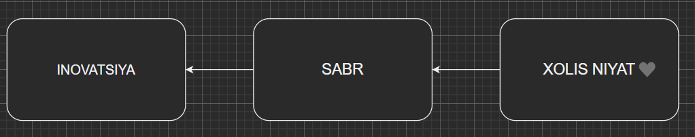
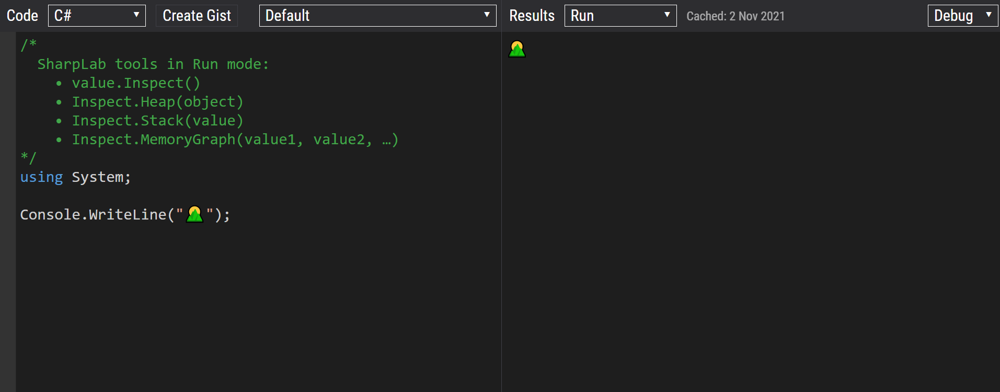
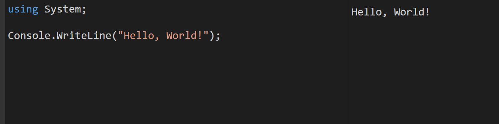

# Kirish

Siz dasturlashni puxta o'rganmoqchimisiz? 
Xalqaro kompaniyada dunyoning eng yetuk dasturchilari bilan yonma-yon ishlashni xohlaysizmi? 
Buning ortidan mo'maygina daromad topishnichi? 

Unda ushbu kurs aynan siz uchun. Kurs davomida siz _xalqaro maydonda katta obro'ga ega bo'lgan_, _juda tez sur'atda o'sib takomillashib borayotgan_, C# dasturlash tilini o'rganasiz. Bu til va kurs davomida o'rgatiladigan barcha texnologiyalarda foydalanib har qanday dasturning yuragi (yoki texnik til bilan aytganda _backend_) qismini yozishni o'rganamiz.

Kursni tamomlaganingizda _dotnet backend_ dasturchi sifatida ishga yoki amaliyotga topshirishingiz.

## Muallif haqida

Ismim Elbek. Dasturlashga ilk bor Xalqaro Vestminster Universitetiga o'qishga qabul qilinganimda qadam qoyganman. Va 3 yil davomida dasturlashni muntazam o'rganganman. Ha, 3 yil muntazam o'qish. Aynan shu vaqt mobaynida O'zbek, Rus, Belorus va Ukraina millatiga mansub insonlardan to'g'ridan to'g'ri, qolaversa YouTube, Udemy va shunga platformalar orqali Ingliz va Hind dasturchilarining video-darslarini ko'rib o'rganganman. O'rganish hali ham nihoyasiga yetgani yo'q, hozirgi kunlarda Microsoft kompaniyasida Bosh Enjinering Menejeri (Senior Engineering Manager) lavozimida ishlab kelayotgan va PiorSoft kompaniyasi asoschisi [Hassan Rezk Habib](https://www.linkedin.com/in/hassanrezkhabib) Uztozimizga ham shogird ham qo'llarida dasturchi sifatida bu soha sir asrorlarini o'rganib kelyapman.

Bundan tashqari [YouTube kanalim](https://www.youtube.com/DasturlashniOrganamiz) orqali minglab insonlarga bilganlarimni ulashib kelmoqdaman. 

O'ylaymanki, hozirda ixtiyoringizda bo'lgan o'quv qo'llanmasi innovatsiyalar olamiga qadam qoyishingizga ko'makchi bo'ladi. Ushbu kurs orqali sizlarga [Exadel](https://exadel.com) va [PiorSoft](https://piorsoft.com) kompaniyalarida to'plagan tajribam va bilimim bilan ulashishni niyat qildim.

## Kursda nimalar o'rgatiladi 

Til: C#

Framework: .NET 6 

Ma'lumotlar bazasi bilan ishlashda _Entity Framework_ ishlatiladi. 

## Ushbu soha egasining odatiy ish kuni

C# dasturlash tili bilan ishlaydigan dasturchilar xilma-xil pozitsiyalarda ish olib borishadi. Bu o'z ichiga o'yinlar yaratish, dastur 'backend' qismini yaratish va hozirda jadallik bilan rivojlanayotgan dasturning 'frontend' qismini yozish ham imkoniyati tug'ilmoqda. 

Biz siz bilan backend dasturchi pozitsiyasiga tayorlanayotgan ekanmiz, o'zimni misolimda ushbu soha vakilining odatiy kun tartibi haqida gaplashib olamiz. 

Ertalab soat 9:00 dan taxminan 9:20 / 30 gacha jamoa a'zolari bilan uchrashuv. Agar chet elliklar jamoasida ishlayotgan bo'lsangiz bu uchrashuv Zoom, Microsoft Teams yoki shunga o'xshagan dastur orqali amalga oshiriladi. Bu payt davomida kecha nima qilganingiz va bugungi rejalaringiz haqida ma'lumot berib o'tasiz.

Meetingdan so'ng choy yoki kofeni oldingizga olasida, sizga yuklatilgan vazifani qilishni boshlaysiz. Agar jamoada erkinlik berilgan bo'lsa ro'yxatdan eng muhim ishni olib shuni ustida ishlashni boshlaysiz. Asosan ishingiz ma'lum bir ma'lumotni bazadan olib frontendga uzatish yoki aksini realizatsiya qilish bo'ladi. Butun boshli biznes protses sizning qo'lingizda bo'ladi. 

Yoki, aynan mana shu ma'lumotlar uzatish jarayonida ko'p hollarda xatoliklar chiqib turadi. Buni texnik tilda "BUG" ('bag' deb talaffuz qilinadi) deyishadi. Ishingiz shu "BUG" larni to'g'rilash bo'ladi. 

Ishlash jarayonida qiyinchilikga duch kelib qolsangiz birga ishlaydigan sherigingizdan yordam so'rashingiz mumkin bo'ladi va birgalikda bu ishni tugallashingiz ham mumkin. 

## Kurs oxirida qanday natija kutiladi

Kursni muvaffaqiyatli tamomlaganingizda hozirda Toshkentda faoliyat yuritayotgan xalqaro IT kompaniyalardan biriga amaliyot o'tashga topshiringiz mumkin bo'ladi. Agar kursning oxirgi bo'limida o'rgatiladigan mavzularni puxta o'zlashtirib berilgan vazifalarni to'liq bajara olsangiz junior .net dasturchi pozitsiyasiga ham qabul qilishingiz mumkin bo'ladi. 

Nima bo'lgan taqdirda ham, ushbu safarni boshlayotgan ekansiz o'z yo'lingizni topib olguningizgacha qo'ldan kelgan yordamni ko'rsatishga harakat qilaman. 

Kurs davomida siz 3 ta dastur tuzib borasiz. Bular: 
1. KESCHA ("kesha" o'qiladi). Bu dastur sizlarga C# asoslarini o'rganish va uni amalda qo'llab borish uchun yozib boriladigan dastur. 

2. CALCULATR ('kalkulator' o'qiladi). Bu dastur sizlarga C# asoslarini o'rganish va uni amalda qo'llab borish uchun yozib boriladigan 2 chi dastur. 

3. SHINAM - ijaraga shinam uy topish endi oson. Bu dastur sizlarga C# ning murakkab mavzularini amalda qo'llash va ma'lumotlar bazasi va API chiqarishni amalda qo'llash uchun yoziladigan dastur.


## Maslahatlar 

__Dasturlash/dasturchilar haqida to'g'ri tasurotga bo'ling__

Ko'pchilik dasturchi deganda inovatsiyalar va minglab dollarlik startaplar xayoliga keladi. Ammo, bu to'liq emas, to'laqonli taasurotga ega bo'lish uchun yana bir necha komponentlarni qo'shishkerak. 



Bularning har biri ikkinchisiga asos bo'lib xizmat qiladi. Har qanday innovatsiya qilish uchun yillar davomida mehnat qilish kerak bo'ladi. Aksariyat hollarda, mehnat tekingga qilasiz. Facebook, Instagram yoki shunga o'xshagan biror bir dastur yo'qki ularning dunyoga taqdim qilgan insonlar ma'lum bir vaqt tekinga ishlashmagan bo'lishsa. 

Demak, sabrning o'rnini tushunib yetgan bo'lsak, endi shu sabrni yoqilg'isi bo'lmish _xolis niyat_ haqida gaplashsak. Agar sizda niyatingiz o'zingizdan kattaroq bo'lmasa, avvalo yillar davomida dasturlashni o'rganishga va bundan so'ng hech qanday pul topmasdan o'tirib inovatsiya qilishga sabringiz yetmasligi mumkin. 

Har bir insonning dunyo qarashi, e'tiqodi va hayotdagi prinsiplaridan kelib chiqib, ushbu o'zidan kattaroq maqsad turlicha bo'lishi mumkin. Misol uchun, farzandi uchun borini bergan, uni kamolotga yetkazish va o'z yo'lini topib ketishi uchun tun-u kun mehnat qilgan o'ta-onasini ko'rgan o'quvchi, o'ziga o'xshagan birodarlarini tezroq o'rganishlari va tezroq hayotda o'rin egallashlari uchun ta'lim platformasi ustida jiddu-jahd bilan mehnat qilishi mumkin. 


## Hello World!

Keling, endi kod yozishni birgalikda boshlaymiz. Hozir ishlatib turgan veb-brauzeringizda [sharplab.io](https://sharplab.io) deb yozing va bu saytga o'ting. 



Tepadagi kabi veb-sahifa ochilishi kerak sizda ham. Chap tomondagi oynadan barcha kodni o'chirib tashlang. 

Endi esa quyidagi kod parchasini aynan o'sha oynaga ko'chiring: 

```csharp
using System;

Console.WriteLine("Hello, World!");
```

Agar sizda ham o'ng tomondagi kabi yozuv chiqgan bo'lsa, tabriklayman birinchi C# dasturingizni muvaffaqiyatli yoza oldingiz. 




