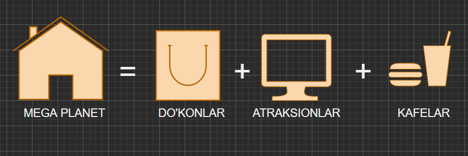
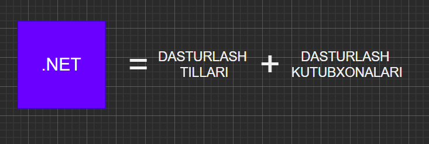
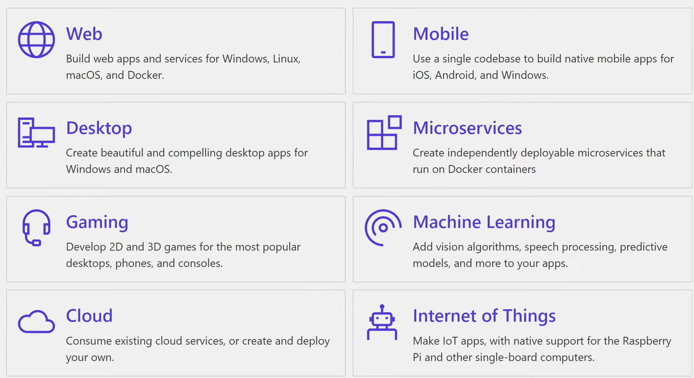

## .NET o'zi nima? 

.NET dasturlash ekosistemasi hisoblanadi. Rostini aytadigan bo'lsam, bu gapni C# o'rganishni boshlaganimda o'zim ham unchalik tushunmas edim. Keling sizga ham sodda tilda tushuntiraman. 

Tepadagi rasmda ko'rib turganingiz Toshkent shahrida qad ko'targan Mega Planet majmuasi. Bu joy sizning xarid qilishingiz, dam olishingiz va mazza qilib ovqatlanishingiz uchun ekosistema hisoblanadi. Buning uchun bu majuamada savdo do'konlari, atraksionlar va kafelar siz uchun qurib qoyilgan. 

Demak, 

Xuddi, shu tarzda .NET bu: 

.NET ekosistemasida esa siz turli xil dasturlar yarata olasiz. Misol uchun, siz mobil (Android, IOS), web va kompyuter (Windows, macOS) dasturlarni tuza olasiz. Qolaversa, o'yinlar, sun'iy intellekt va machine learning, cloud va IoT platformalarini ham tuza olasiz. 

Oldin aytib o'tganimdek, .NET bu - kutubxonalar va dasturlash tillari. Kutubxonalar sizga turli platformalar bilan hech qanday qiyinchiliksiz bog'lana olishingiz imkonini beradi. Masalan, veb-sahifa tuzmoqchi bo'lsak kodni brauzerga aks ettirishni .NET siz uchun qilib beradi. Mobil va kompyuter ilovalar uchun ham shunday. 

Turli xil qurilmalar bilan bo'g'lana oldik, endilikda ular uchun kod yozish kerak. Buning uchun .NET taqdim qiladigan dasturlash tillari mavjud. Bular C#, F# va VB (visual basic). Buning orasida eng mashhuri C# ni ushbu kursda siz bilan o'rganamiz. 

