## Kerakli Dasturlarni O'rnatamiz

Bu bo'limgacha yetib kelgan ekansiz, allaqachon birinchi dasturni yozib o'zingizni dasturchi sifatida his qilgan bo'lishingiz kerak. Endilikda kod yozish uchun bizga kerak bo'ladigan dasturni va biz uchun Microsoft jamoasi tomonidan yozib berilgan kod kutubxonalarini komyuterimizga o'rnatishimiz kerak bo'ladi. 

Keling, birinchi aynan shu kutubxonalardan boshlaymiz. 
 
[Download .NET 6](https://dotnet.microsoft.com/en-us/download/dotnet/6.0)

Tepadagi linkni ustida bosganingizda, sizda mana bunday sahifa ochilishi kerak: 

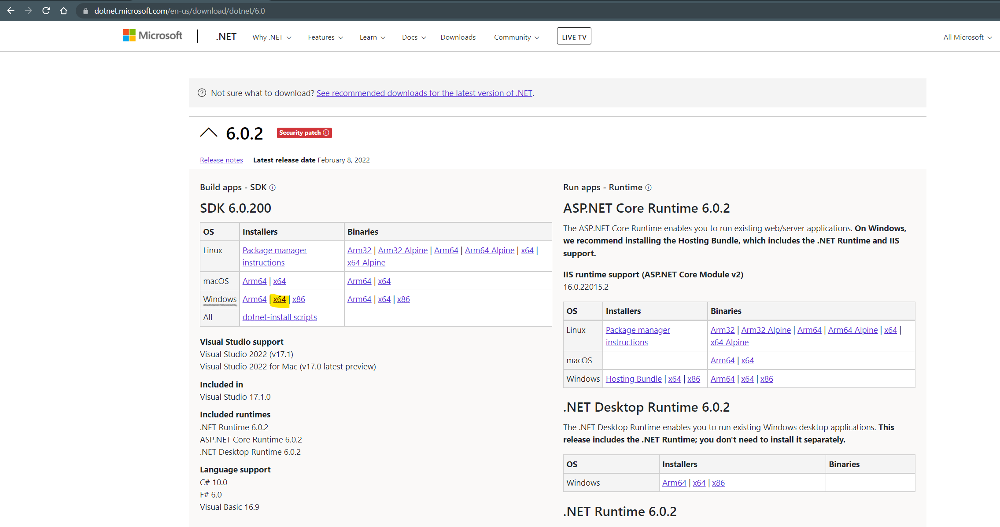

Chap tomondagi tepadan birinchi jadvaldan, o'zingizni kompyuteringizni operatsion sistemasi va protsessoriga moslab .NET kutubxonalarini yuklab olasiz. Mening holatimda Windows x64 versiyasi mos kelgani uchun, shuni yuklab oldim. 

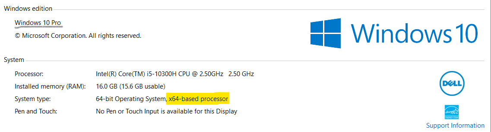


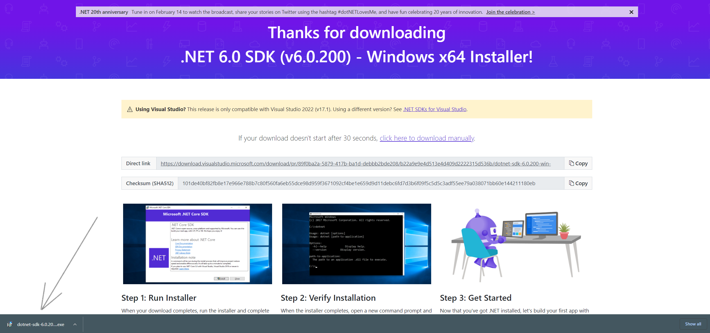

Tepadagi rasmda ko'rsatilgan dasturni o'rnatish qo'lingizdan kelishiga ishonaman. Shunchaki uni ustiga bosib, dasturni o'rnatib oling. 

So'ngra Windowns Qidiruv qismiga o'tib __CMD__ deb qidiring. 

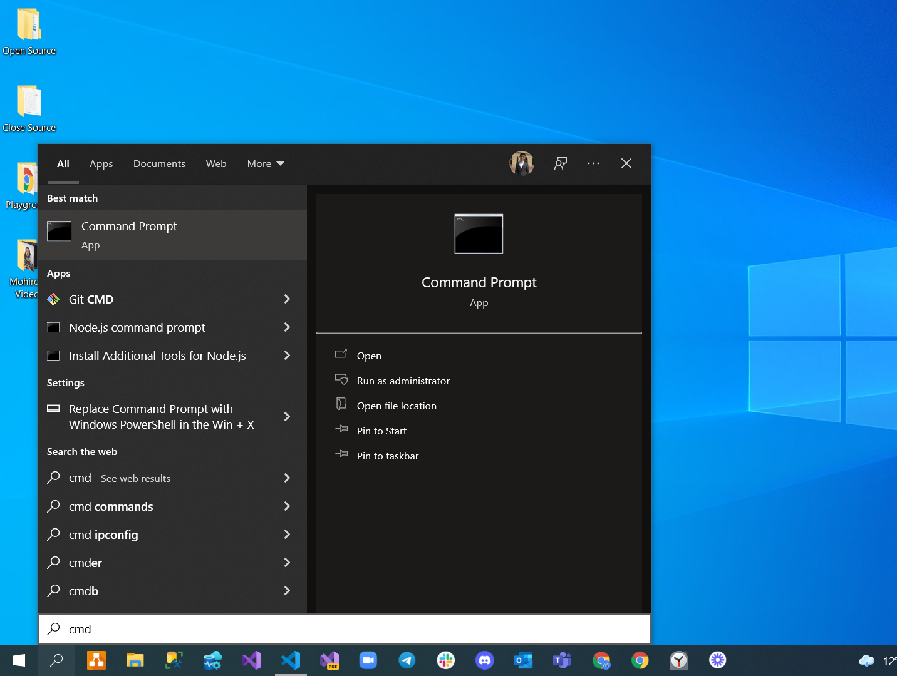

_Command Prompt_ dasturini oching. Sizda ham mana bunday dastur ochilishi kerak: 

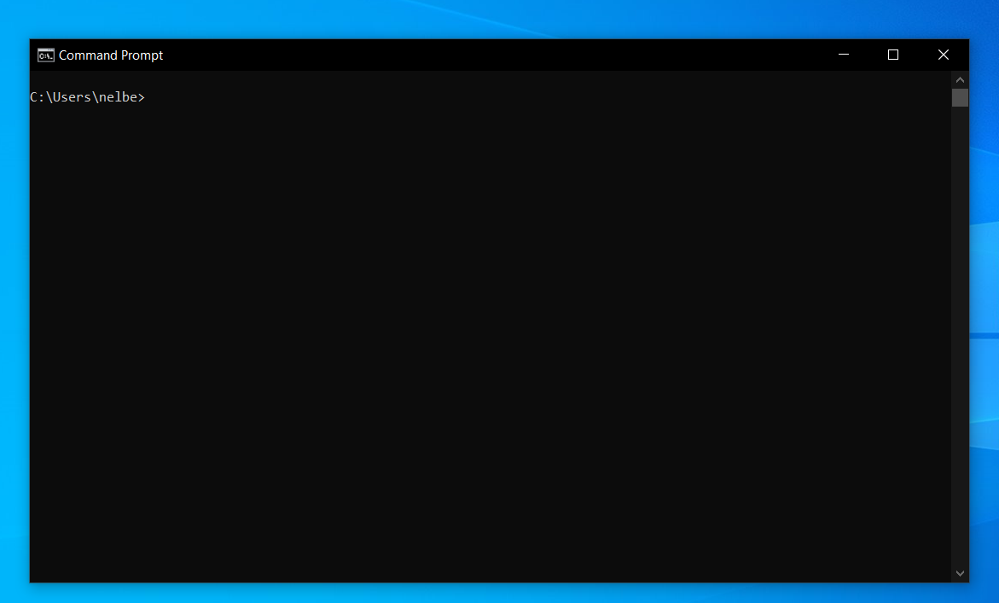


Quyidagi kodni shu qora oyna ichiga yozing: 

```
dotnet --version 
```

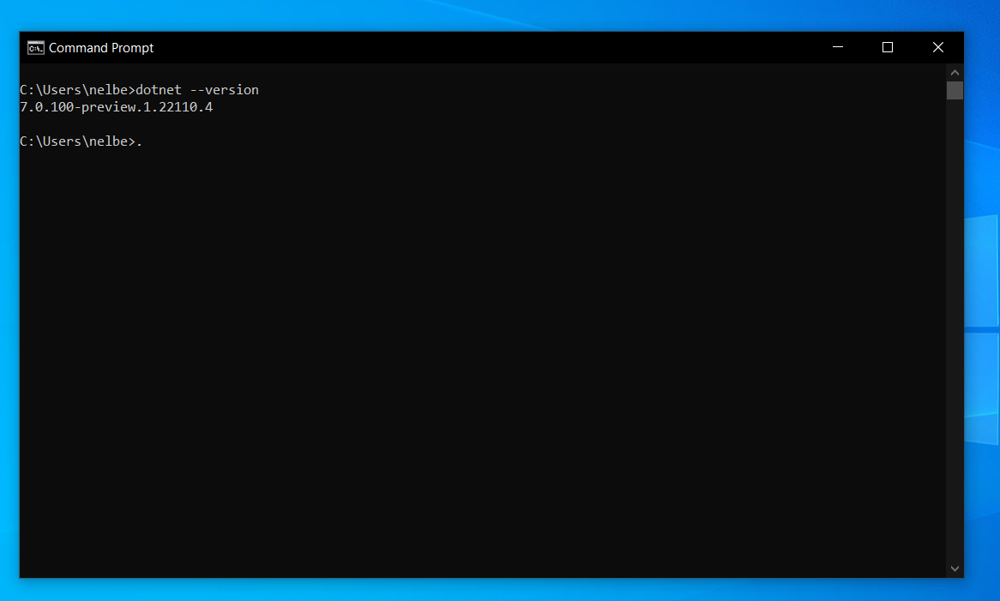

Manda .NET ning 7 chi - hozirda eng oxirgi versiyasi o'rnatilgan. 


 Sizda esa shu 6 chi versiyasini ko'rsatishi kerak.

 Endi esa komyuteringizdan quyidagi papkaka kiring va .NET nimaligini o'z ko'zingiz bilan ko'rishingiz mumkin: 

 ``` 
C:\Program Files\dotnet\sdk
 ```

 Ushbu papkada komyuteringizda o'rnatilgan .NET ning hamma versiyalarini ko'rishingiz mumkin. Misol uchun mening kompyuterimda 4 ta versiyasi o'rnatilgan ekan: 

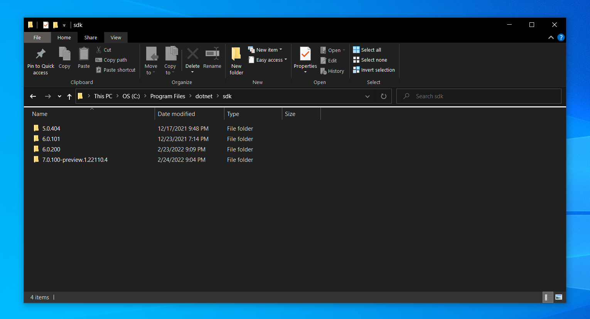


`6.0.200` deb nomlangan papkani ichida .NET ning siz uchun yozib qoyilgan hamma kodlarini ko'rishingiz mumkin.


.NET ni o'rnatib bo'lgan ekansiz. Endilikda siz bilan .NET dan va C# tilidan foydalanib, o'zimizning komyuterda kod yoza olishimiz uchun `Visual Studio Code` dasturini o'rnatib olishimiz kerak. 

Buning uchun quyidagi linkni ustiga bosing: 
[Download VS Code](https://code.visualstudio.com/Download)

Operatsion Sistamangizga mos o'rnatuvchini tanlaysiz va ustiga bosasiz. Manda Windows 10 bo'lgani uchun 1-chi tugma ustiga bosaman. 

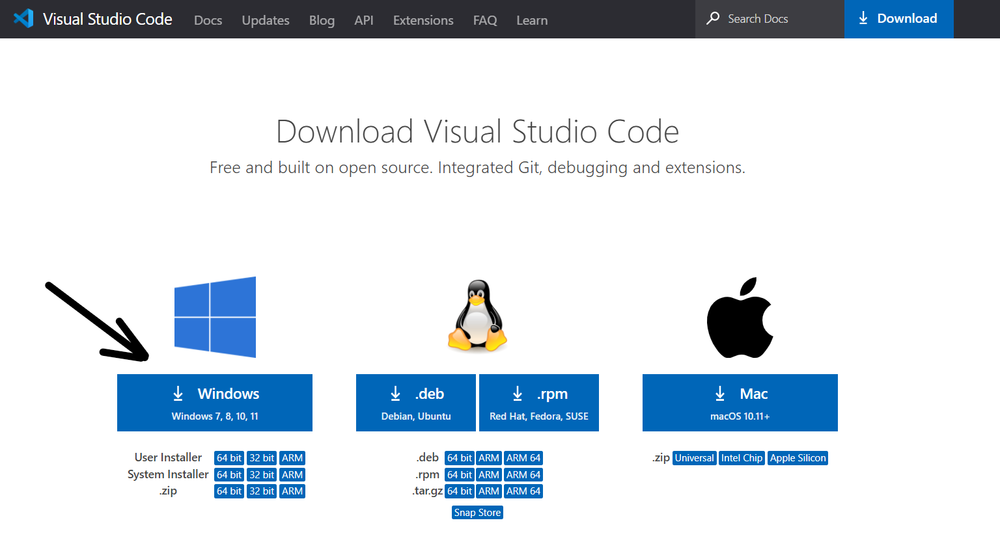

Bundan keyin sizda ham ushbu dastur o'rnatuvchisini yuklab olish jarayoni boshlanadi. 


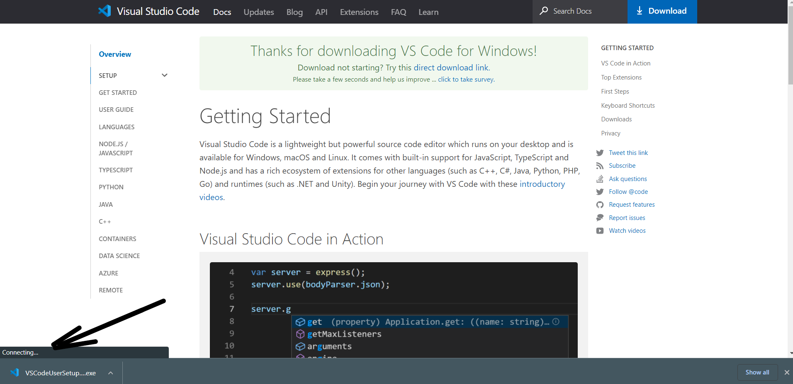

`VSCodeUserSetup.exe` faylini ustiga bosib dasturni o'rnatib olasiz. 

Bu dasturni `Visual Studio Code` yoki `VS Code` deb ataymiz. Bu dastur bizlarga C# kod yozishimizga imkon beradi. Dasturni ochganingizda sizda ham quyidagicha oyna ochilishi kerak: 

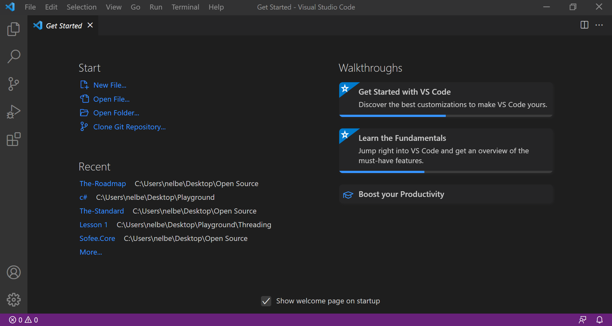

Chap tomondan tepadan birinchi tugmaga e'tiboringizni qarating. Bu 2 ta bet belgisi bilan ajratib qoyilgan. Ustiga bossangiz sizda mana bunday bo'lim ochiladi. 

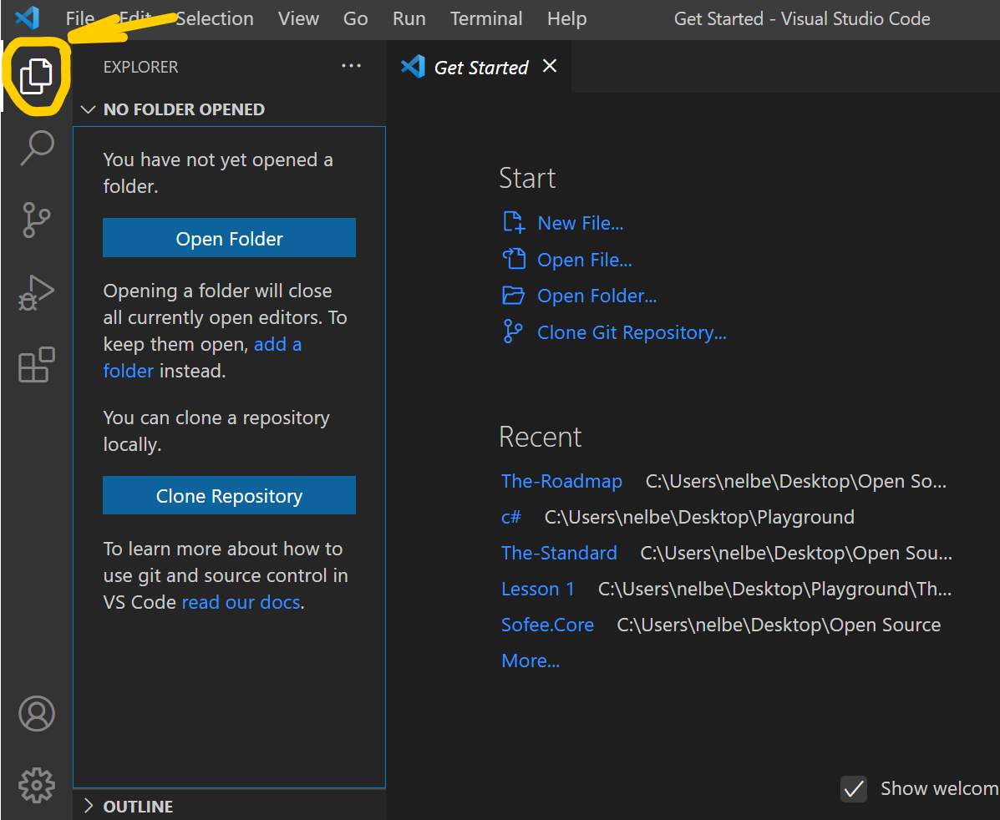

Bu bo'lim biz ishlaydigan asosiy bo'lim hisoblanadi va bu orqali biz papka va kod yozadigan fayllarimiz bilan ishlaymiz. 

Keyingi bo'lim bu chap tomonda tepadan eng pastgi tugma. bu bo'lim orqali biz `VS Code` dasturimizni C# tilini tushuna olishi uchun qo'shimchalarni yuklab olamiz. Bu qo'shimchalar __plugin__ deyiladi. Telefoningizdagi `Play Market` yoki `App Store`ga o'xshaydigan bir bo'lim

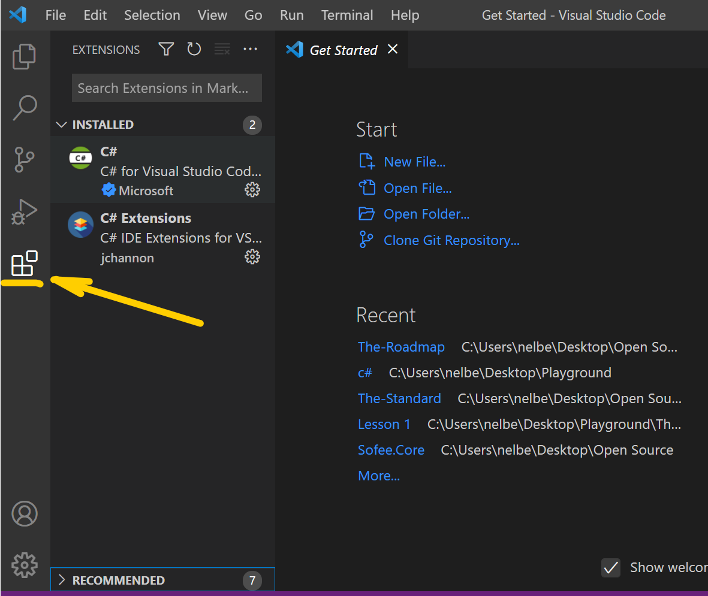

Ko'rib turganingizdek, menda 2 ta plugin. Siz ham qidirish bo'limida `C#` deb qidiring va sizda ham quyidagicha natija chiqishi kerak: 

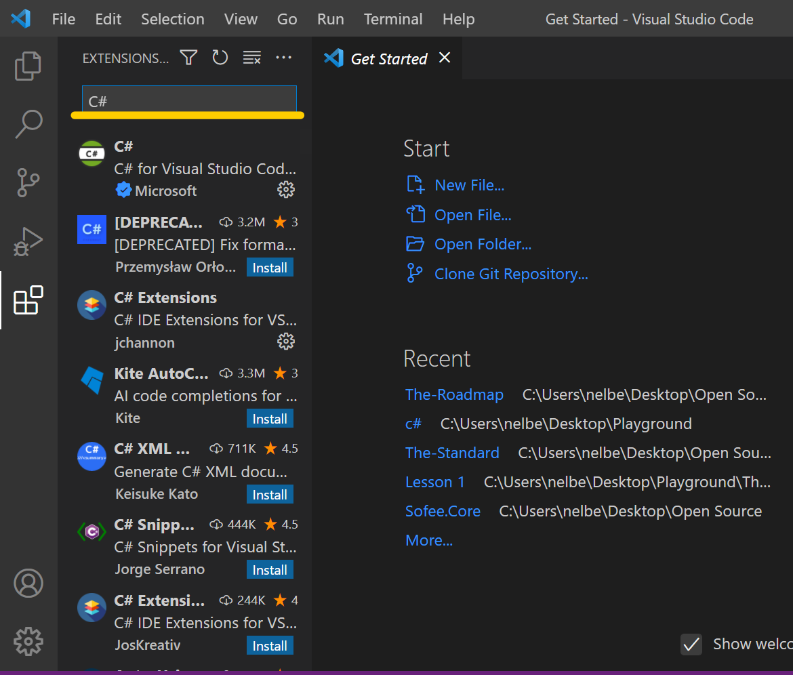

Bu yerdan 1-pluginni yuklab oling

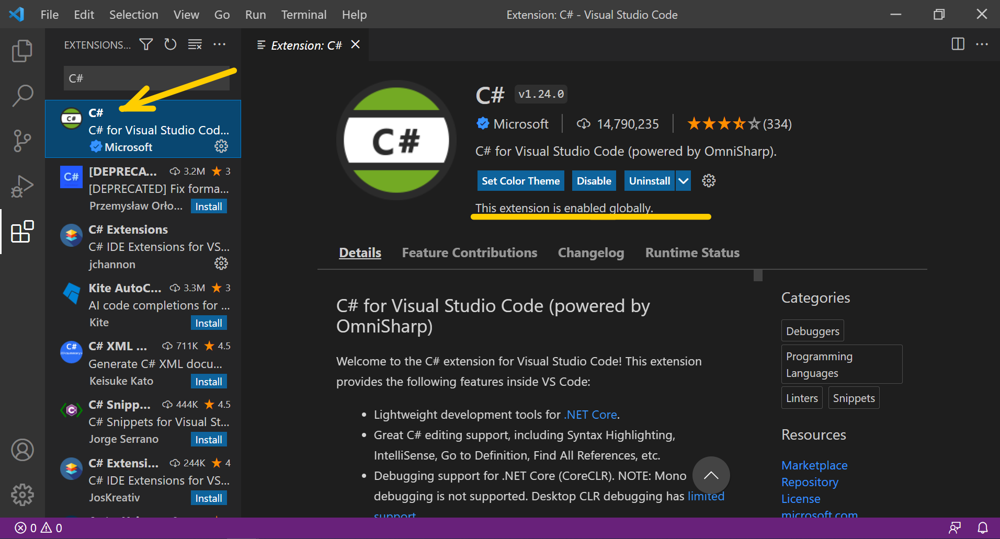

Va bundan keyin 2-pluggini ham yuklab oling

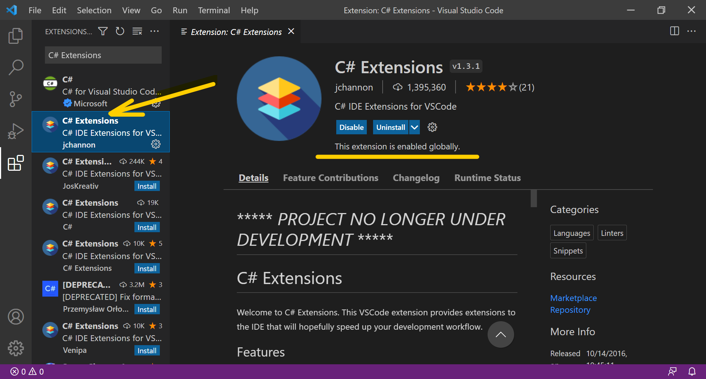


Sizning komyuteringiz kod yozishga tayyor!