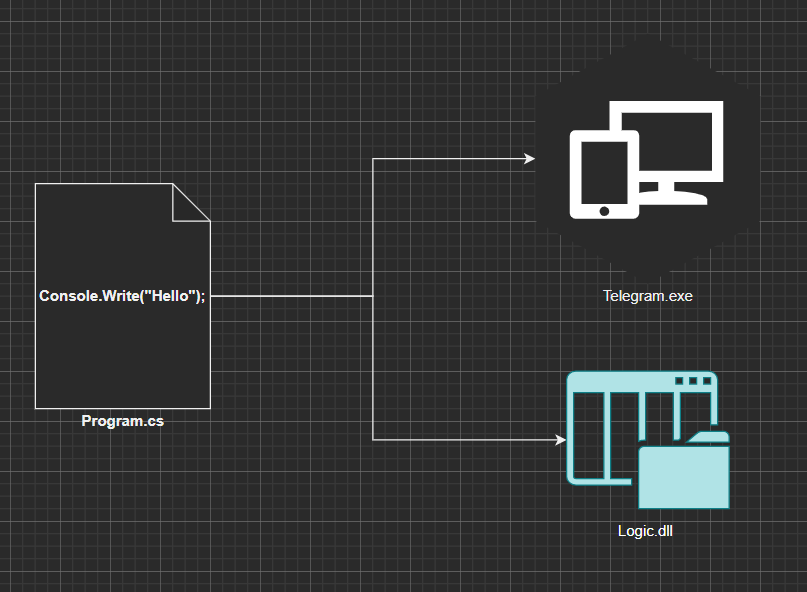
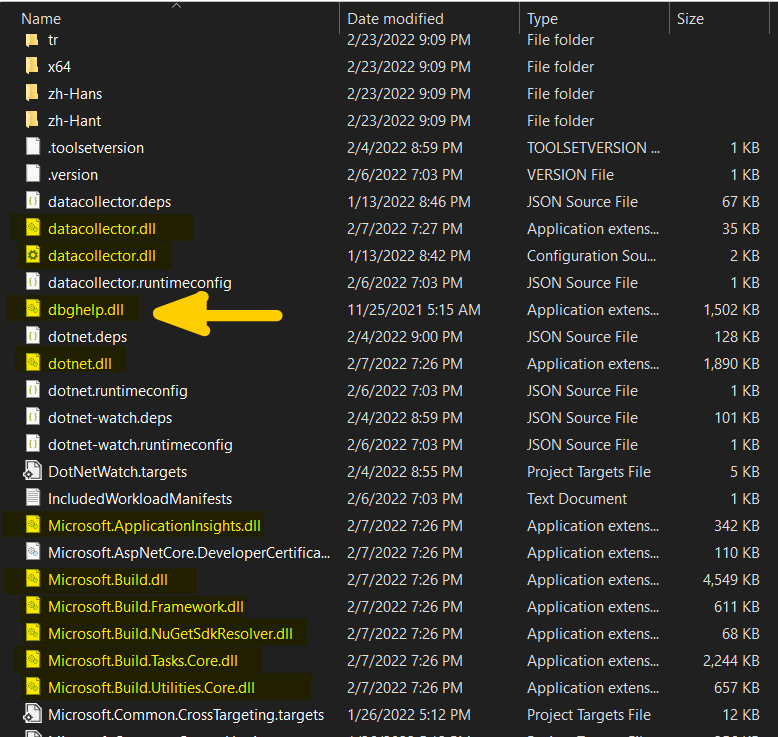

## Fayl Turlari (.cs, .exe, .dll)




`.cs` - bu fayl turi hisoblanadi. Misol uchun, siz agar Notepad dasturini ochib faylni saqlasangiz bu - file-name`.txt` ko'rinishida bo'ladi. Word fayl file-name`.docx` turida saqlanadi. Xuddi shundek, siz-u biz yozgan C# kod saqlanganda file-name`.cs` fayli turida saqlanadi. 

Keyinchalik aynan shu `.cs` formatida saqlangan kod 2 xil faylga ko'chirilishi mumkin. Bu bizning dastur yaratish boshida tanlagan loyiha turimizga bog'liq. 

`.exe` - bu turdagi faylni kompyuterimiz yoki telefonimiz tushunadi va shu fayl turi orqali kodni ishga tushiradi. 

`.dll` - bu faqatgina yozilgan kodni keyinchalik boshqa bir `.exe` fayl foydalanishi uchun yig'ib qoyilgan fayl turi. Oldin ham aytib o'tganimdek .NET bu kutubxona va tillarning yig'indisi. Aynan shu kutubxonalar `.dll` formatida saqlangan. Marhamat o'zimning kompyuterimda rasmga tushirilgan fayllarni ko'rishingiz mumkin: 



Tepadagi fayllar jamlanga papkaga borish uchun quyidagi yo'ldan foydalanishingiz mumkin: 

``` terminal 
C:\Program Files\dotnet\sdk
```
