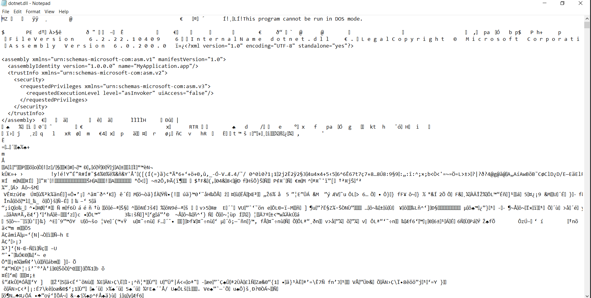
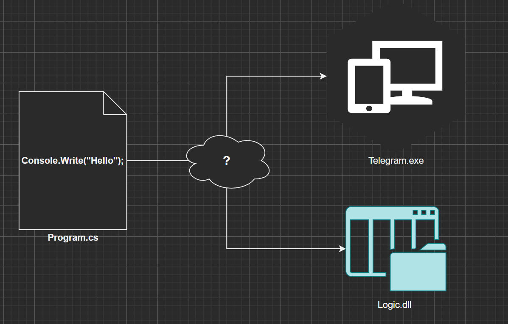
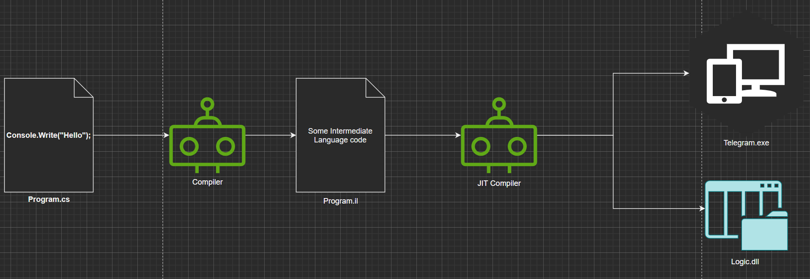

## C# aslida qanday ishlaydi?

O'tgan mavzuda shu narsa aniq bo'ldiki, biz yozgan C# kod yoki `.exe` yoki `.dll` ko'rinishda bo'lishi mumkin ekan. Endi keling birgalikda o'sha fayllardan birini ichini ochib ko'ramiz. 



Aynan o'sha papkada mavjud dotnet.dll faylini ochganimda bizga tushunarsiz belgilar ko'rinib qoldi. Bu bizning kompyuterimiz tushunadigan tilgan ko'chirilgan kod hisoblanadi. 




Hozir biz yozadigan C# kod qanday qilib kompyuter tushunadigan kodga ko'chirilish jarayonini tushuntirib o'taman. 



Biz o'zim tushunadigan dasturlash tilida kodni yozamiz. Keyinchalik esa Microsoft jamoasi biz uchun tuzib bergan dastur (nomi __Compiler__) bizning C# dasturni __O'rta Til__ ga ko'chiradi. Buni ingliz tilida __Intermediate Language__ deb yuritiladi. Misol uchun, Program.cs C# fayli Program.il fayliga o'girilidi. Keling, sharplab.io dagi buning yaqqol misolini ko'rsataman: 


``` csharp
using System;

Console.WriteLine("Hello, World!");
```

Tepadagi qisqagina kod quyidagicha IL kodga ko'chiriladi: 

``` csharp
.assembly _
{
    .custom instance void [System.Private.CoreLib]System.Runtime.CompilerServices.CompilationRelaxationsAttribute::.ctor(int32) = (
        01 00 08 00 00 00 00 00
    )
    .custom instance void [System.Private.CoreLib]System.Runtime.CompilerServices.RuntimeCompatibilityAttribute::.ctor() = (
        01 00 01 00 54 02 16 57 72 61 70 4e 6f 6e 45 78
        63 65 70 74 69 6f 6e 54 68 72 6f 77 73 01
    )
    .custom instance void [System.Private.CoreLib]System.Diagnostics.DebuggableAttribute::.ctor(valuetype [System.Private.CoreLib]System.Diagnostics.DebuggableAttribute/DebuggingModes) = (
        01 00 07 01 00 00 00 00
    )
    .permissionset reqmin = (
        2e 01 80 92 53 79 73 74 65 6d 2e 53 65 63 75 72
        69 74 79 2e 50 65 72 6d 69 73 73 69 6f 6e 73 2e
        53 65 63 75 72 69 74 79 50 65 72 6d 69 73 73 69
        6f 6e 41 74 74 72 69 62 75 74 65 2c 20 53 79 73
        74 65 6d 2e 50 72 69 76 61 74 65 2e 43 6f 72 65
        4c 69 62 2c 20 56 65 72 73 69 6f 6e 3d 36 2e 30
        2e 30 2e 30 2c 20 43 75 6c 74 75 72 65 3d 6e 65
        75 74 72 61 6c 2c 20 50 75 62 6c 69 63 4b 65 79
        54 6f 6b 65 6e 3d 37 63 65 63 38 35 64 37 62 65
        61 37 37 39 38 65 15 01 54 02 10 53 6b 69 70 56
        65 72 69 66 69 63 61 74 69 6f 6e 01
    )
    .hash algorithm 0x00008004 // SHA1
    .ver 0:0:0:0
}

.class private auto ansi '<Module>'
{
} // end of class <Module>

.class private auto ansi abstract sealed beforefieldinit '<Program>$'
    extends [System.Private.CoreLib]System.Object
{
    .custom instance void [System.Private.CoreLib]System.Runtime.CompilerServices.CompilerGeneratedAttribute::.ctor() = (
        01 00 00 00
    )
    // Methods
    .method private hidebysig static 
        void '<Main>$' (
            string[] args
        ) cil managed 
    {
        // Method begins at RVA 0x2050
        // Code size 12 (0xc)
        .maxstack 8
        .entrypoint

        IL_0000: ldstr "Hello, World!"
        IL_0005: call void [System.Console]System.Console::WriteLine(string)
        IL_000a: nop
        IL_000b: ret
    } // end of method '<Program>$'::'<Main>$'

} // end of class <Program>$
```

Bizning birinchi __Compiler__ (_kompayler_ deb o'qiladi) C# tilini IL tiliga ko'chirishnigina biladi, xolos. Bu kompiler o'z ishini bajarib bo'lgach, sahnaga uning o'rtog'i chiqadi. Uning nomi __JIT Compiler__ (_jit kompayler_ o'qiladi). Bu faqatgina IL kodni kompyuter kodga ko'chirishnigina biladi. 

    Kompyuter kod - bu bizning kompyuterimiz tushunib bajara oladigan instruksiyalar ketma-ketligi. 

### Nega unda birdaniga kompyuter kodga ko'chira qolmaymiz? 

Buni tushunish uchun birinchi navbatda nima uchun 2 ga bo'lib C# kodi __kopmyuter kod__ ko'chirilayotganini bilishimiz kerak. 

    Kodni ko'chirish, ya'ni biz tushunadigan tildan kompyuter tushunadigan tilga o'girish texnik terminda _kompilatsiya qilish_ deb ataladi. Inglizchasi - Compilation 

Birinchi (C# dan IL ga) kompilatsiya qilish jarayoni bizga, .NET qo'llab quvvatlaydigan barcha tillarni umumlashtirish va vaqti kelganda, bir necha tilni kuchli tomonlarini jam qilgan holda murakkab va tez dasturlar tuzishga imkon beradi. Bizda umumiy til bor ekan, endilikda __jit kompayler__ shu kodni olib qanaqa kompyuterda kodni ishga tushirayotgan bo'lsak, aynan shu kompyuterning texnik imkoniyatlariga qarab kodni ko'chirib beradi. Bu xuddi kara jadvalini 1-sinf va 4-sinf o'quvchilariga tushintirishdek gap. 1-sinf o'quvchisiga soddaroq va sekinroq ma'lumotlar yetkazilganidek, protsessorini hajmi kichik kompyuterga instruksiyalar shunga mos ravishda ko'chiriladi. Bu instruksiyalarni samarali tarzda texnikaga yetkazish imkoniyatini beradi. 

E'tibor bergan bo'lsangiz, IL umumiy bo'lgani bilan _jit kompayler_ ishlab turgan kompyuterga mos kodga ko'chirib beradi. Ya'ni, IL kodi __ishga tushirilgan paytda__ to'g'ridan to'g'ri kompyuter kodga ko'chiriladi. Shuning uchun ham uning nomi _Ayni Paytdagi Kompilatsiya_ (Just-In-Time Compilation => JIT Compilation) deb nomlanadi.  