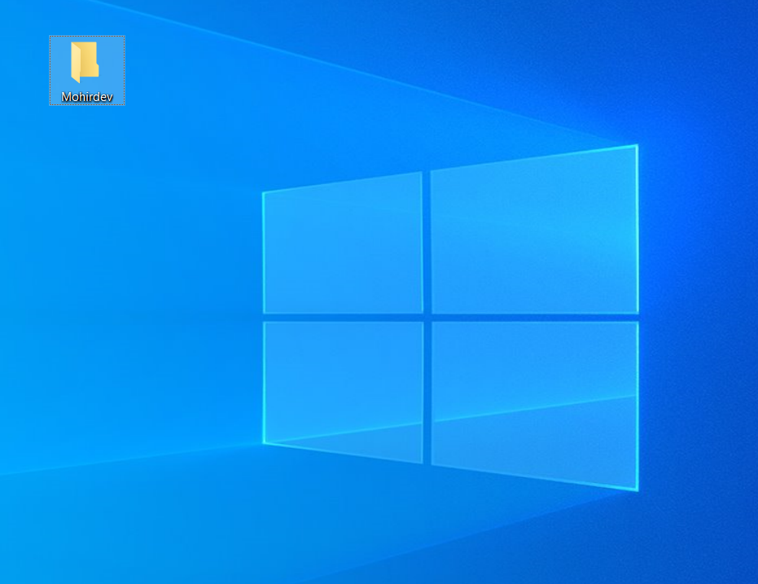
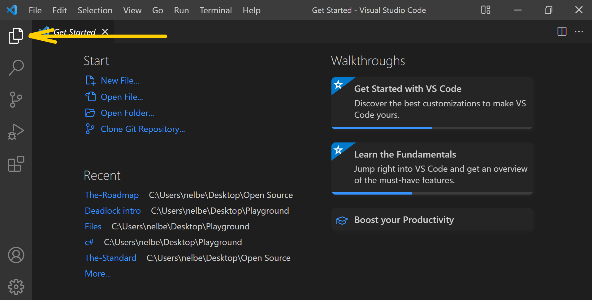
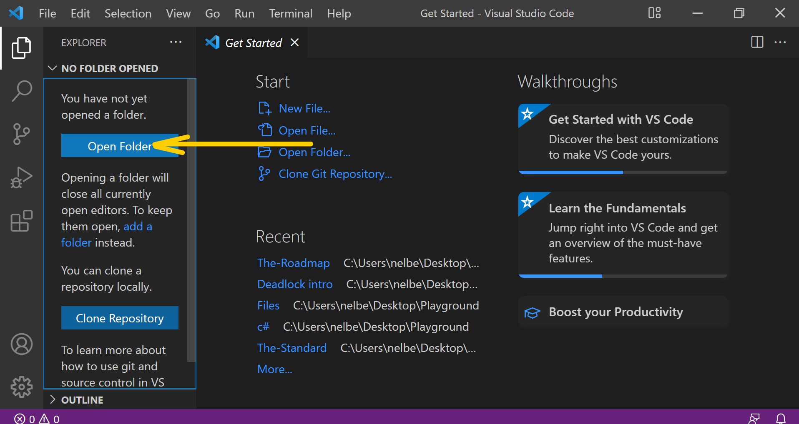
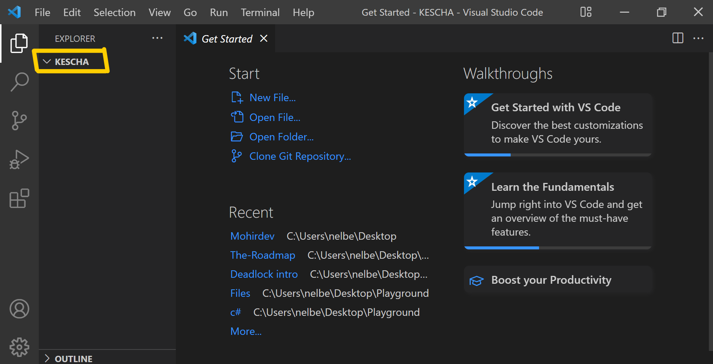
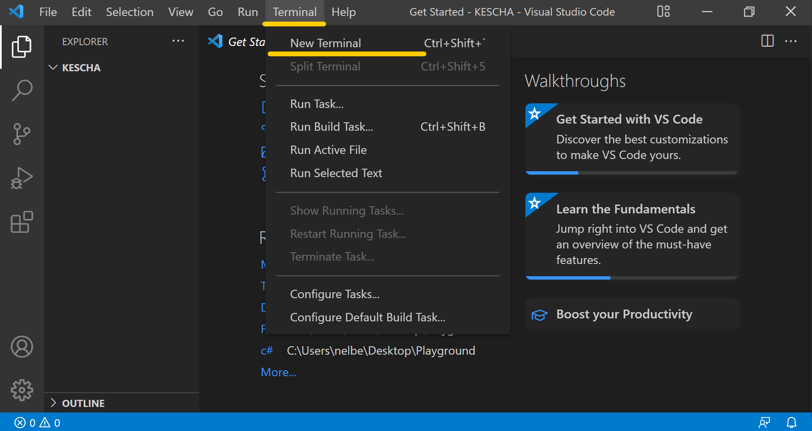
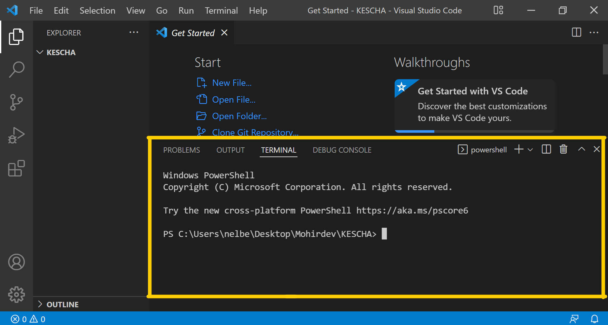
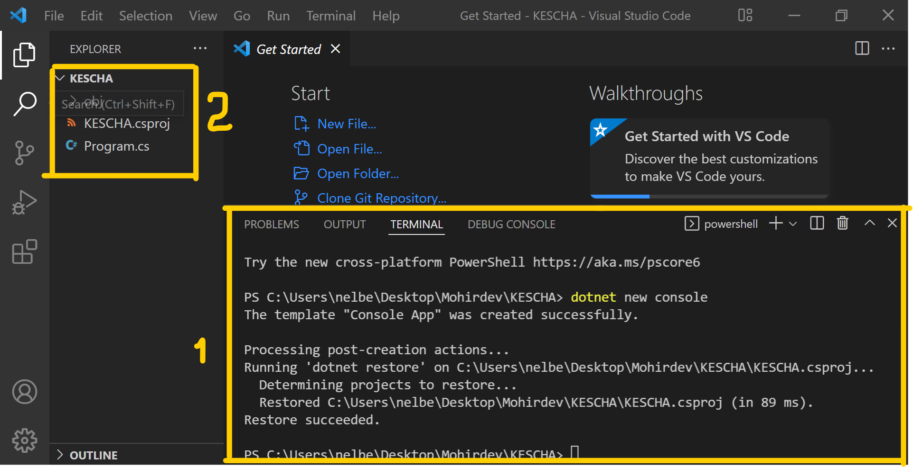
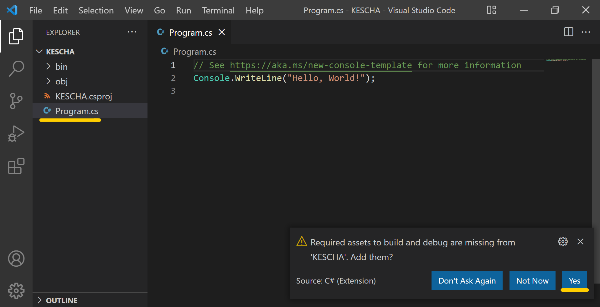
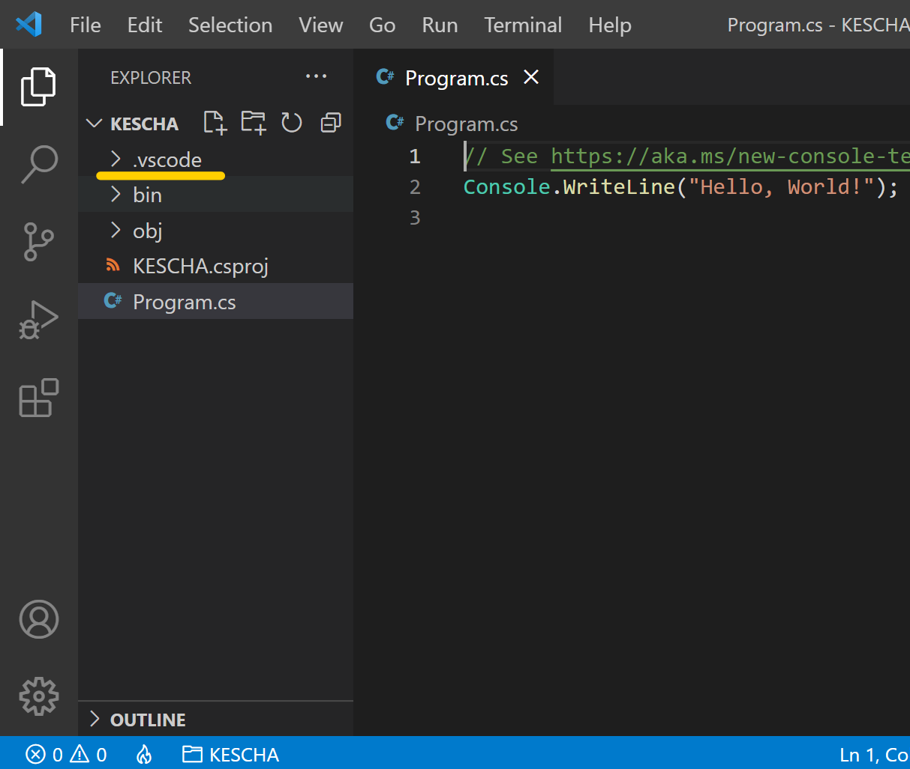
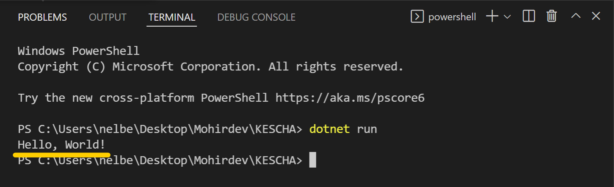

## Yangi loyiha yaratamiz.

Endilikda siz bilan birinchi loyihamizni VS Code dasturi orqali yaratamiz. Buning uchun keling, ushbu kurs darslarini saqlab borish uchun kompyuterimizda bir papka yaratamiz. Men 'Mohirdev` deb nomladim:



Uning ichida birinchi loyihamizni saqlash uchun KESCHA deb nomlangan papka ham ochdim. 


VS Code ga o'tamizda, chap tomondan birinchi belgi ustiga bosamiz: 



Sizda quyidagicha oyna ochilishi kerak: 



_Open Folder_ tugmasini ustiga bosib, oldinroq yaratgan faylimizni ochib olamiz. 

Natija mana bunday bo'lishi kerak: 


Tepadagi menu dan `Terminal` bo'limi topib, `New Terminal` ni tanlang: 


Pastda yangi oyna ochiladi: 


Bu oyna orqali yangi loyiha yaratish buyrug'ini birgalikda yozamiz: 

```terminal
dotnet new console
```

Tepadagi kod xatosiz ko'chiring yoki kompyuterda o'qiyotgan bo'lsangiz, sehrli tugmalarni bosish orqali ko'chirib o'zingizni terminalingizga qoying. Sehrli tugmalar bular `ctrl + C` (ko'chirish) va `ctrl + V` (qoyish)

Natija: 




Chap tomoningizda 3 ta fayl yaratilgan bo'lishi kerak. Biz bugun asosan _Program.cs_ fayli bilan ishlaymiz. Birinchi terminalni yopib, _Program.cs_ ni ustiga 2 martta bosganingizda, taxminan, 1-2 sekund ichida sizda ham quyidagicha oyna chiqadi undan "Yes" tugmasini bosing: 



Bu orqali VS Code dasturni yuritish uchun barcha bog'liq bo'lgan fayllarni olib keladi va `.vscode` faylida saqlaydi: 



Tepadagi menu dan `Terminal` bo'limi topib, `New Terminal` ni tanlang. Hozir ushbu dasturni siz bilan yuritamiz. 

```terminal
dotnet run
```

Natija: 

