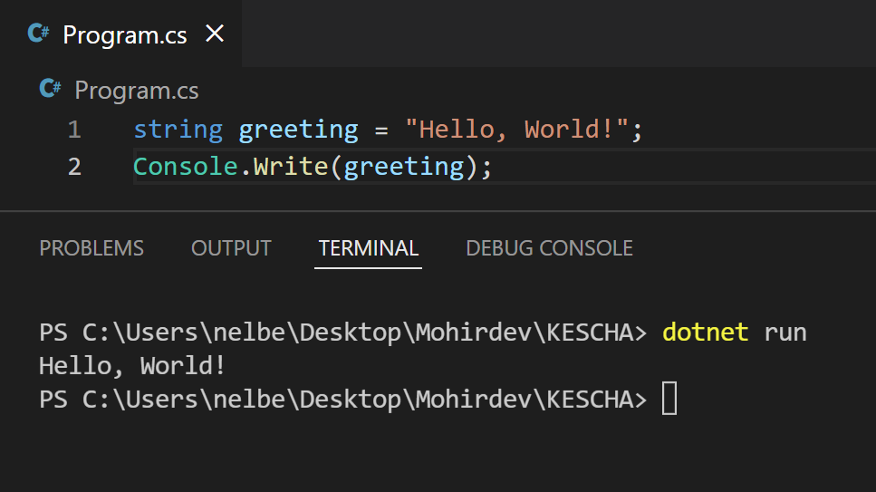
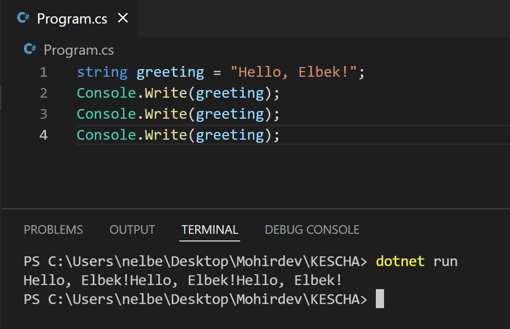

## String nima?

Sizlar bilan birma-bir C# dasturlash tilida ma'lumot turlari haqida gaplashamiz. Biz o'rganadigan ma'lumot turlari `primitive` turlar deb ataladi. Ingliz tilidan tarjima qilganda `eng oddiy` turlar deb tarjima qilish mumkin. Shulardan biri _string_ hisoblanadi.


Ekranga chiqarishda oldinroq qo'shtirnoqlar ichida matn yozgan edik va uni ekranga chiqargan edik. Aynan shu bizning string ma'lumot turimiz edi. 

```csharp
Console.Write("Hello, World!");
```

Ko'p hollarda biz ekranga bir xil ma'lumotni qayta-qayta chiqarishimiz kerak bo'ladi. Misol uchun bizga __Hello, World!__ yozuvini 3 martta ekranga chiqar degan vazifa qoyilsa, mana bunday bajarishimizga to'g'ri kelar edi: 

```csharp
Console.Write("Hello, World!");
Console.Write("Hello, World!");
Console.Write("Hello, World!");
```

Va bundan keyin __World__ so'zini __Elbek__ ismiga o'zgartishimiz uchun 3 qatorni o'zgartishga to'g'ri kelar edi. Haqiqiy loyilarda bu son 3 ta emas, 300 tagacha yetishi mumkin.

Shuning uchun biz qo'shtirnoq ichidagi string turidagi ma'lumotimizni, unga mos keluvchi o'zgaruvchiga saqlaymiz. 

### Sintaksis

O'zgaruvchi yaratish uchun quyidagicha sintaksisga amal qilish kerak: 

```csharp
tur uzgaruvchiNomi = qiymat
```

Shu sintaksisni yodingizga saqlang. Keling bundan kelib chiqib birinchi _string_ turidagi o'zgaruvchimizni yaratamiz. 

```csharp
string greeting = "Hello, World!";
```

Endilikda ushbu o'zgaruvchini konsolga yozuv chiqaratigan fuksiyamizni ichiga berib yuboramiz: 

```csharp
string greeting = "Hello, World!";
Console.Write(greeting);
```

Faylni saqlaymiz. Buning uchun `ctrl + S` tugmalarini birgalikda bosamiz. Qayta dasturni ishga tushirganimizda bizda quyidagicha natija chiqishi kerak: 



Endi uch martta chiqarish va bir joyda o'zgartirish uchun quyidagicha kod yozasiz: 



### Xotira egallashi

Bu o'zgaruvchimiz komyuter xotirasidan egallaydigan joyni hisoblash uchun barcha qo'shtirnoq ichidagi belgilar sonini aniqlashimiz kerak. Har bir belgi 2 bayt (byte) joy egallaydi. Bundan tashqari ma'lumot turi o'zining turli xossalari uchun 12 bayt talab qiladi. Shunday ekan, quyidagi yo'l bilan hisoblash mumkin

    xotira = 12 + (2 * belgilarSoni)

Keling, oldingi `greeting` o'zgaruvchimizni qancha xotira egallayotganligini hisoblab ko'ramiz. 

    "Hello, World!" da 13 ta belgi bor ekan. Oldin aytganimdek har biri 2 bytedan olsa 26 byte bo'ladi. Shunda: 

    xotira = 12 + (2 * 13) => 12 + 26 => 38 bytes

Demak, bizning birinchi o'zgaruvchimizning egallagan xotirasi 38 byte ekan. 

### Console Bilan Ishlash

Hozirda siz konsolga string ma'lumot turini chiqarishni bilasiz. Agar `Console.Write("Hello");` buyrug'ini ketma-ket yozib ko'rgan bo'lsangiz, yozuvlar konsolda bir qatorda yozilganligini ko'rasiz. Har bir buyruq alohida qatorda bo'lishini xohlasangiz, unda `Write` buyrug'ini o'rniga `WriteLine` buyrug'ini yozishingiz kerak bo'ladi. Shunda har bir qavslarni ichidagi matn alohida qatorda chiqadi.

Ba'zan konsolda foydalanuvchiga yozishiga imkon berishimiz ham kerak. Misol uchun, cmd konsolida doimiy ravishda sizning yozishingizni kutib turadi. Buni `ReadLine` buyrug'i orqali amalga oshirish mumkin. 

Quyidagi kod parchasi haqida bosh qotirib ko'ring. 

```csharp
using System;

string userText = Console.ReadLine();

Console.WriteLine("Showing the user text");
Console.WriteLine(userText);
```

Natijani ko'rish uchun KESCHA loyihasiga kodni ko'chirib tekshirib ko'ring.

### Vazifa

Ekranga o'zbekchada salom berishni yozuvini chiqaring. Misol uchun: "Salom, Abdulloh" yoki o'zingizning ismingizni qoyishingiz ham mumkin. 

