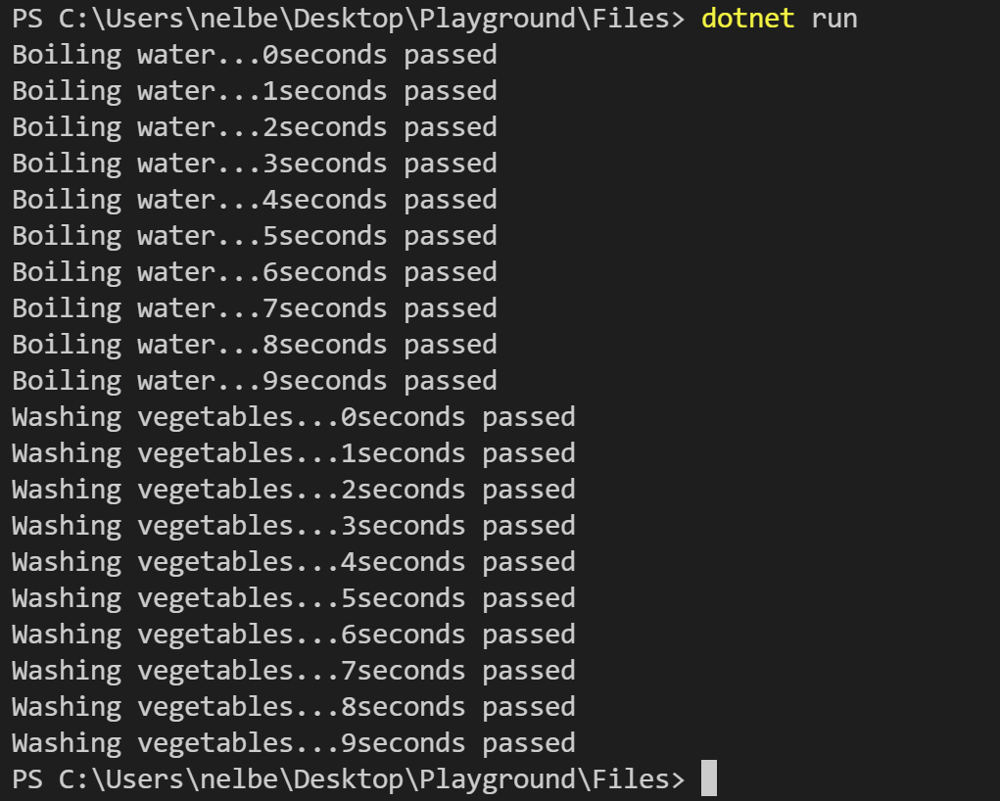
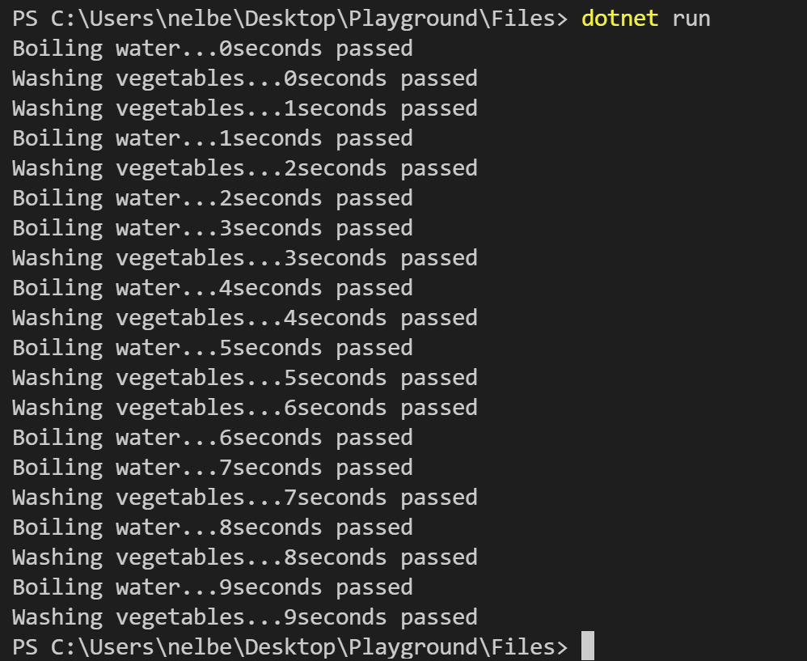

# Thread

`Thread` ma'lum kod parchasini olib alohida _yo'lakchda_ uni bajarib kelish xususiyatida ega. Misol uchun, agar ekranga sonlarni yig'indisini hisoblash natijasini chiqarayotgan bo'lsak va xuddi shu paytning o'zida `enter` tugmasini bosilishini kutib turishni xohlasak buning uchun bizga _2 ta yo'lakcha_ kerak bo'ladi. Aynan shunday paytda `thread` yaratib ikkita funksiyani alohida alohida ishlatishimiz mumkin. 

Keling odatiy hayotimizdagi 2 ishni funksiyaga yozib ularni chaqirib ko'ramiz. Tasovvur qilamiz, kechki ovqatga tayyorgarlik ko'ryapmiz. Bu jarayon _suv qaynatish_ va _sabzavotlarni yuvish_ ishlarini o'z ichiga oladi. Odatda suvni qaynashga qoyib, `bir paytning o'zida` sabzavotlarni yuvishga tushib ketamiz. Keling birgalikda dasturimizda buni tekshirib ko'ramiz. 
```` csharp
BoilWater();
WashVegetables();

static void BoilWater(){
   for (int i = 0; i < 10; i++)
   {
      Console.WriteLine("Boiling water..." + i + "seconds passed");
   }
}

static void WashVegetables(){
   for (int i = 0; i < 10; i++)
   {
      Console.WriteLine("Washing vegetables..." + i + "seconds passed");
   }
}
````

Tepadagi kod parchasini ishga tushirganimizda, quyidagi natija chiqdi: 



Ideal holatda ikkalasi bir vaqtning o'zida ishlashini xohlaymiz. Demak, buning uchun ikki metod uchun 2 ta thread yaratamiz. 


``` csharp
Thread gasThread = new Thread(BoilWater);
Thread sinkThread = new Thread(WashVegetables);
```

Yangi thread obyektini yaratayotganimizda metodning `delegate` ni parametr sifatida yuborishimiz kerak bo'ladi. 


thread o'z ishini boshlashi uchun uni _Start()_ metodini chaqirishimiz kerak bo'ladi. 

``` csharp 
gasThread.Start();
sinkThread.Start();
```

Kodni ishga tushirishdan oldin, metodlarga ozgina o'zgartirish kiritishimiz kerak. Metodning ichida agar `Thread` klasini statik klass sifatida chaqirsak, aynan, shu metod ishlab turgan _thread_ da ma'lum bir amallar bajarishimiz mumkin. Bulardan biri uni ma'lum muddatga 'uxlatib' turish. Kompyuter 10 ta iteratsiyani bajarishda juda tez bo'lgani uchun thread ni 'uxlatmasdan' kodni ishga tushirsak avvalgidek natija ko'rsatishi mumkin va bu bizga thread lar alohida ishlayotganini tushinishimizga to'sqinlik qiladi. Shuning uchun for siklini ichida ekranga yozuvni chiqarganimizdan keyin 1 sekundga thread ni uxlatib turamiz. 

Thread statik klasinining Sleep metodi argument sifatida sonni qabul qiladi va bu son millisekundda hisoblanadi. 


``` csharp
static void BoilWater(){
   for (int i = 0; i < 10; i++)
   {
      Console.WriteLine("Boiling water..." + i + "seconds passed");
      Thread.Sleep(1000);
   }
}

static void WashVegetables(){
   for (int i = 0; i < 10; i++)
   {
      Console.WriteLine("Washing vegetables..." + i + "seconds passed");
      Thread.Sleep(1000);
   }
}
```

Natija:



